# 📄 Documentação de Projeto - RPG Master (Versão 1.0)

Este documento de projeto foi elaborado pelo aluno Miguel Figueiredo Diniz como parte da disciplina Projeto de Software.

## 📅 Histórico de Revisões

| Nome | Data | Razões para Mudança | Versão |
|------|------|---------------------|--------|
| Primeira versão | 15/11 | Preenchimento inicial do documento | 1.0 |

---

## 1. Introdução

Este documento agrega a elaboração e revisão de modelos de domínio e modelos de projeto para o sistema RPG Master.

O sistema tem como objetivo centralizar o gerenciamento de campanhas, personagens e regras de Role-Playing Game, atendendo às necessidades de Mestres (GMs) e Jogadores (Players). Ele permite a criação e gerenciamento de:

- **Campanhas**
- **Fichas de personagens** (PCs e NPCs)
- **Sistemas de regras customizáveis**
- **Registro de sessões**

---

## 2. Modelos de Usuário e Requisitos

### 2.1 Descrição de Atores

O sistema possui dois perfis principais de usuários com diferentes níveis de permissão:

| Ator | Papel e Permissões |
|------|-------------------|
| **Mestre (GM)** | É o administrador da campanha e possui o conjunto mais amplo de permissões. É responsável por:  • Criar, editar e deletar campanhas • Escolher e configurar Sistemas de Regras para cada campanha • Gerenciar a lista de Jogadores e seus Personagens participantes • Criar, editar e deletar NPCs (Personagens Não-Jogadores) • Acessar e editar fichas completas de todos os NPCs e PCs da campanha • Criar e gerenciar registros de sessões (data, resumo, notas) |
| **Jogador (Player)** | É o participante das campanhas e possui funcionalidades focadas no gerenciamento de seus próprios personagens. É responsável por:  • Criar, editar e deletar seus Personagens Jogadores (PCs) • Gerenciar fichas de seus PCs com campos dinâmicos baseados no Sistema de Regras • Visualizar campanhas ativas nas quais está participando • Acessar informações básicas das campanhas e histórico de sessões |

### 2.2 Modelo de Casos de Uso e Histórias de Usuários

O sistema é estruturado em torno dos seguintes Casos de Uso (UCs):

| ID | Caso de Uso | Descrição | Ator(es) |
|----|-------------|-----------|----------|
| **UC-01** | Gerenciar Campanha | Permite ao GM criar, editar, visualizar e deletar campanhas, escolhendo sistema de regras e gerenciando jogadores participantes. | Mestre (GM) |
| **UC-01.1** | Criar Campanha | Permite ao GM criar uma nova campanha, definindo nome, descrição e selecionando um sistema de regras. | Mestre (GM) |
| **UC-01.4** | Convidar Jogadores | Permite ao GM adicionar jogadores à campanha através de convites por email ou username. | Mestre (GM) |
| **UC-02** | Gerenciar Personagem | Permite criar, editar e deletar personagens. Players gerenciam seus PCs, GM gerencia NPCs e tem acesso aos PCs. | Mestre (GM), Jogador (Player) |
| **UC-02.1** | Criar NPC | Permite ao GM criar um Personagem Não-Jogador (NPC) associado a uma campanha específica. | Mestre (GM) |
| **UC-02.4** | Criar PC | Permite ao Player criar um Personagem Jogador (PC) vinculado a uma campanha, com ficha baseada no sistema de regras. | Jogador (Player) |
| **UC-03** | Editar Ficha de Personagem | Permite editar dados dinâmicos da ficha (estatísticas, habilidades, inventário, história) conforme o sistema de regras. Validação de permissões. | Mestre (GM), Jogador (Player) |
| **UC-04** | Gerenciar Sistema de Regras | Permite cadastrar, editar e deletar sistemas de regras com templates de fichas customizáveis em formato JSON. | Mestre (GM), Administrador |
| **UC-05** | Registrar Sessão | Permite ao GM criar e gerenciar registros de sessões de jogo com data, resumo e notas, mantendo histórico da campanha. | Mestre (GM) |
| **UC-06** | Visualizar Campanha | Permite visualizar informações da campanha, lista de participantes, sistema de regras utilizado e histórico de sessões. | Mestre (GM), Jogador (Player) |

### 2.3 Diagrama de Sequência do Sistema e Contrato de Operações

Os contratos de operação definem as pré e pós-condições das principais operações do sistema.

#### 1. Contrato: Criar Campanha

| Item | Descrição |
|------|-----------|
| **Operação** | `criarCampanha(nome: String, descrição: String, ruleset_id: Integer, gm_user_id: Integer)` |
| **Pré-condições** | • O usuário está autenticado e possui a role de Mestre (GM). • O ruleset_id fornecido é válido e existe no banco de dados. |
| **Pós-condições** | • Uma nova instância de Campanha foi criada no banco de dados. • A campanha está associada ao GM e ao Sistema de Regras especificado. • O status da campanha foi definido como 'Ativa'. |

#### 2. Contrato: Criar Personagem (Player)

| Item | Descrição |
|------|-----------|
| **Operação** | `criarPersonagem(nome: String, campaign_id: Integer, owner_user_id: Integer, ficha_data: JSON)` |
| **Pré-condições** | • O usuário está autenticado e possui a role de Jogador (Player). • O campaign_id é válido e o jogador tem permissão para criar personagens na campanha. • Os dados da ficha (ficha_data) estão em formato JSON válido. |
| **Pós-condições** | • Uma nova instância de Character foi criada com is_npc como FALSE. • O personagem está associado ao jogador e à campanha. • Os dados da ficha foram armazenados em formato JSON. |

#### 3. Contrato: Editar Ficha de Personagem

| Item | Descrição |
|------|-----------|
| **Operação** | `atualizarFicha(character_id: Integer, user_id: Integer, ficha_data: JSON)` |
| **Pré-condições** | • O usuário está autenticado. • O character_id é válido e o personagem existe. • O usuário possui permissão (é o owner OU é o GM da campanha). • Os campos modificados respeitam o template do Sistema de Regras. |
| **Pós-condições** | • O campo ficha_data do personagem foi atualizado no banco de dados. • Um timestamp de última modificação foi registrado. |

#### 4. Contrato: Registrar Sessão

| Item | Descrição |
|------|-----------|
| **Operação** | `registrarSessao(campaign_id: Integer, gm_user_id: Integer, data: Date, resumo: String, notas: Text)` |
| **Pré-condições** | • O usuário está autenticado e possui a role de Mestre (GM). • O campaign_id é válido, a campanha está 'Ativa' e o GM é o proprietário da campanha. • Os campos obrigatórios (data, resumo) foram preenchidos. |
| **Pós-condições** | • Uma nova instância de Session foi criada e associada à campanha. • O campo last_session da campanha foi atualizado com a data atual. |

---

## 3. Modelos de Projeto

### 3.1 Arquitetura

O sistema de RPG Master utiliza uma Arquitetura em 3 Camadas, conforme o diagrama abaixo:

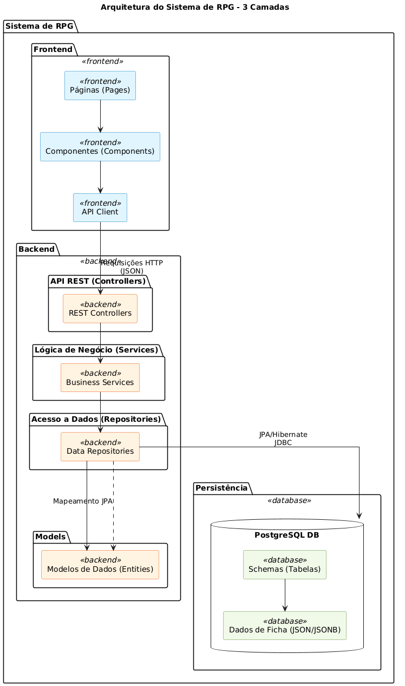

- **Frontend**: Contém as Páginas (Pages) e Componentes (Components), interagindo com o Backend através de um API Client.
- **Backend**: Divide-se em API REST (Controllers), Lógica de Negócio (Services) e Acesso a Dados (Repositories).
- **Persistência**: Utiliza PostgreSQL DB para Schemas/Tabelas e armazena Dados de Ficha em formato JSON/JSONB.
- **Models**: Representam os Modelos de Dados (Entities), mapeados para o banco de dados via JPA.

### 3.2 Diagrama de Componentes e Implantação

O diagrama de componentes detalha os elementos lógicos e funcionais do sistema:

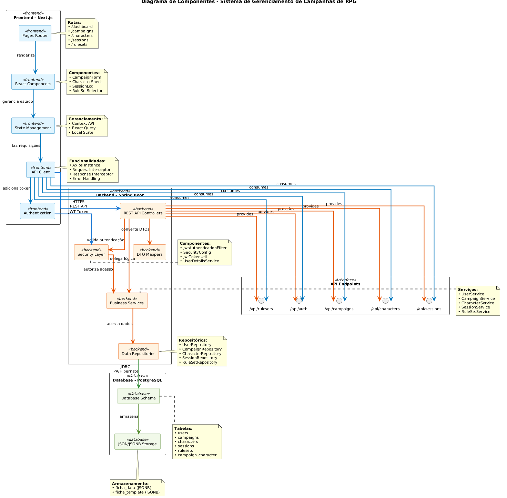

O diagrama de implantação ilustra o deploy em ambientes Cloud:

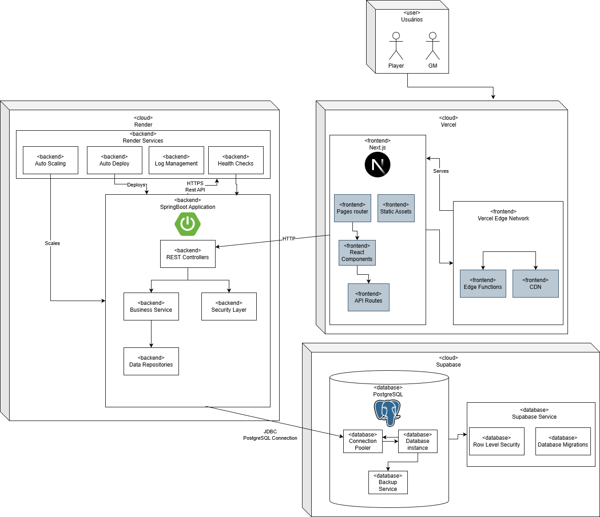

- **Frontend (Next.js)**: Servido no Vercel.
- **Backend (Spring Boot Application)**: Implantado no Render com Auto Scaling e Auto Deploy.
- **Database (PostgreSQL)**: Gerenciado como serviço no Supabase.

### 3.3 Diagrama de Classes

O diagrama de classes simplificado (Modelo de Domínio) apresenta as principais entidades e seus relacionamentos:

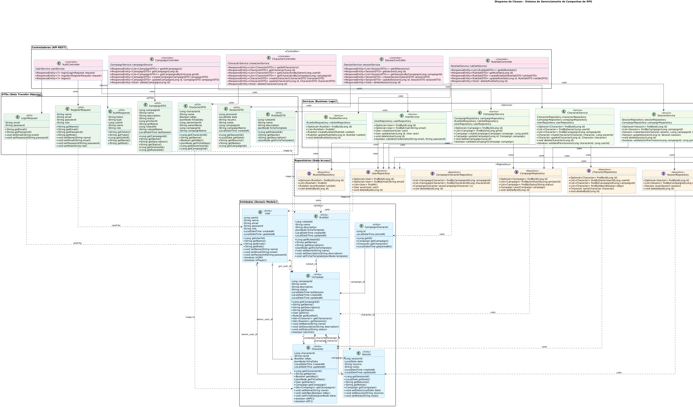

- **User**: role (GM, Player), isGM, isPlayer.
- **RuleSet**: Contém o fichaTemplate em JSON.
- **Campaign**: Possui status (Ativa, Pausada, Concluída), gm_user_id e associação com RuleSet.
- **Character**: Armazena fichaData em JSON e tem o atributo isNPC.
- **Session**: Registra data, resumo e notas para uma campanha.
- **CampaignCharacter**: Tabela de associação N:N entre Campaign e Character.

### 3.4 Diagramas de Sequência

Os diagramas de sequência detalham a interação entre os objetos para os principais Casos de Uso (UCs):

#### UC-01: Criar Campanha

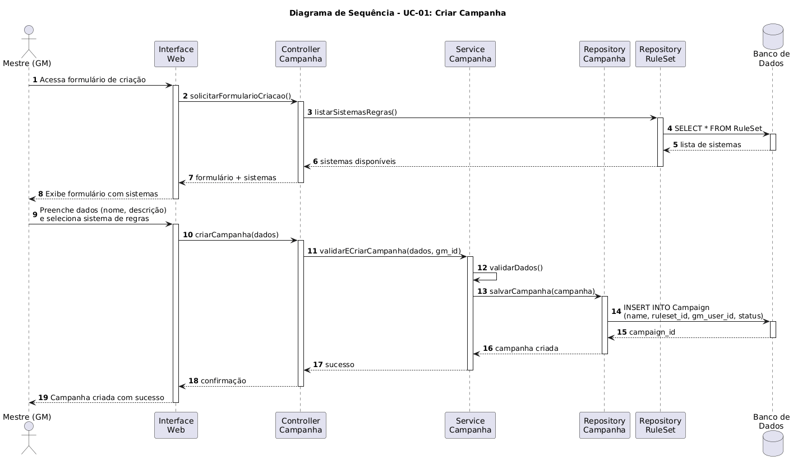

**Fluxo**: GM solicita formulário, Controller lista sistemas (RepositoryRuleSet), exibe formulário. GM preenche, Controller chama Service, que valida e salva a Campaign (RepositoryCampaign).

#### UC-02: Criar Personagem (Player)

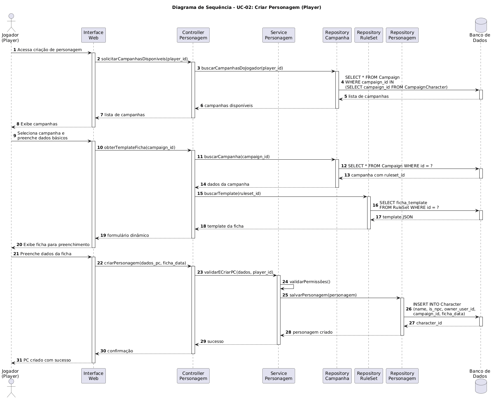

**Fluxo**: Player acessa criação, Controller busca campanhas disponíveis. Player seleciona e solicita template, Controller busca RuleSet da campanha. Exibe formulário dinâmico. Player salva, Controller valida, Service persiste o Character.

#### UC-03: Editar Ficha de Personagem

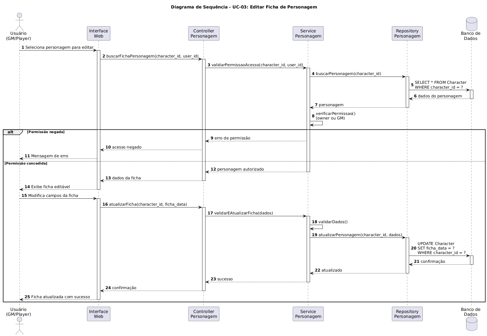

**Fluxo**: Usuário (GM/Player) seleciona personagem. Controller solicita validação de acesso (Service). Se Permissão Negada, exibe erro. Se Permissão Concedida, exibe dados. Usuário modifica. Controller chama Service para atualizar, que valida e persiste (RepositoryPersonagem).

#### UC-05: Registrar Sessão

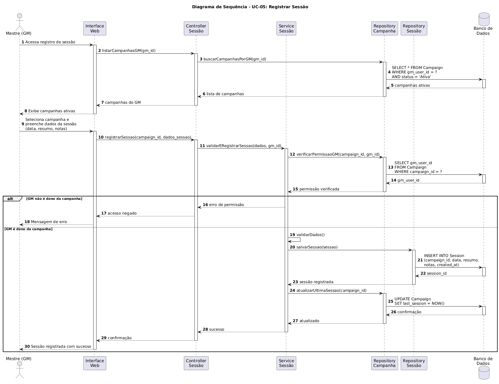

**Fluxo**: GM acessa registro. Controller lista campanhas ativas. GM seleciona e registra. Controller solicita validação de permissão (GM deve ser o dono da campanha). Se autorizado, Service valida dados, salva a Session (RepositorySession) e atualiza a data da última sessão na Campaign (RepositoryCampanha).

### 3.5 Diagramas de Comunicação

Os diagramas de comunicação (alternativa aos de sequência) para os mesmos UCs:

#### UC-01: Criar Campanha

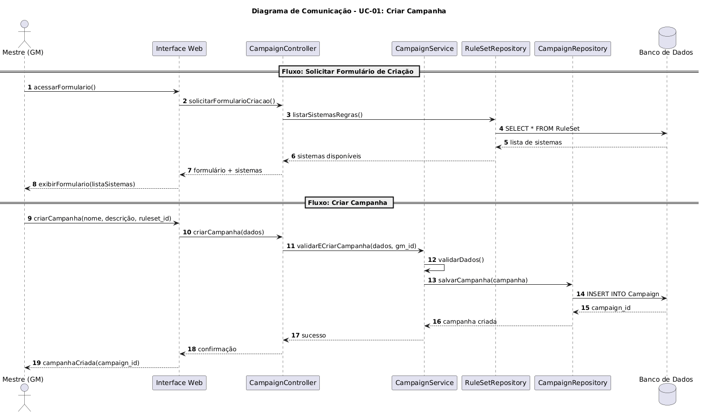

#### UC-02: Criar Personagem

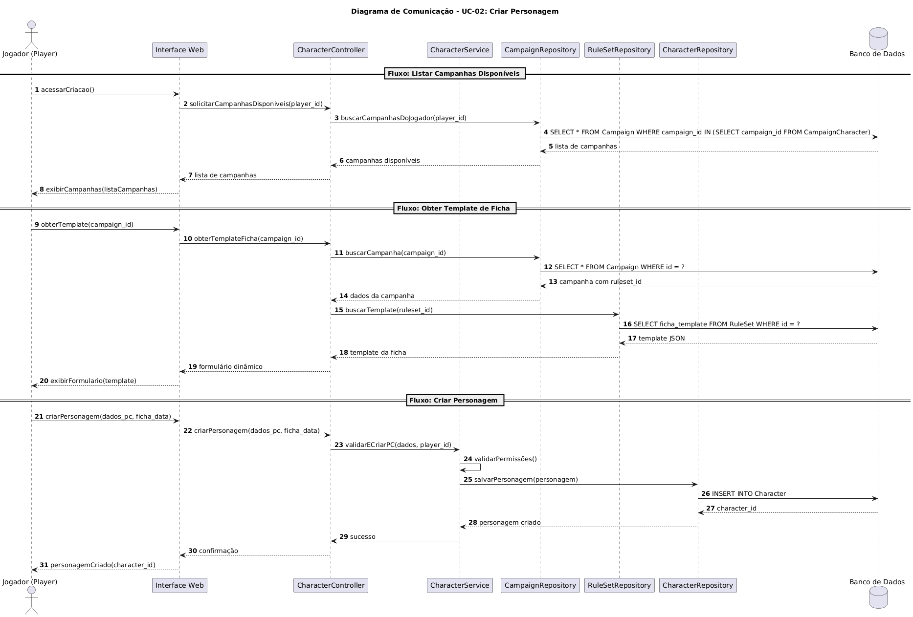

#### UC-03: Editar Ficha de Personagem

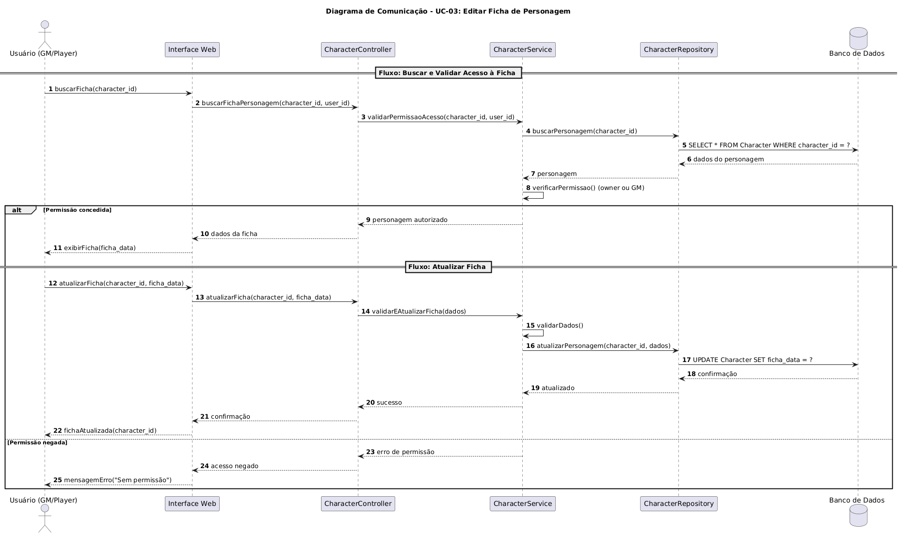

#### UC-05: Registrar Sessão

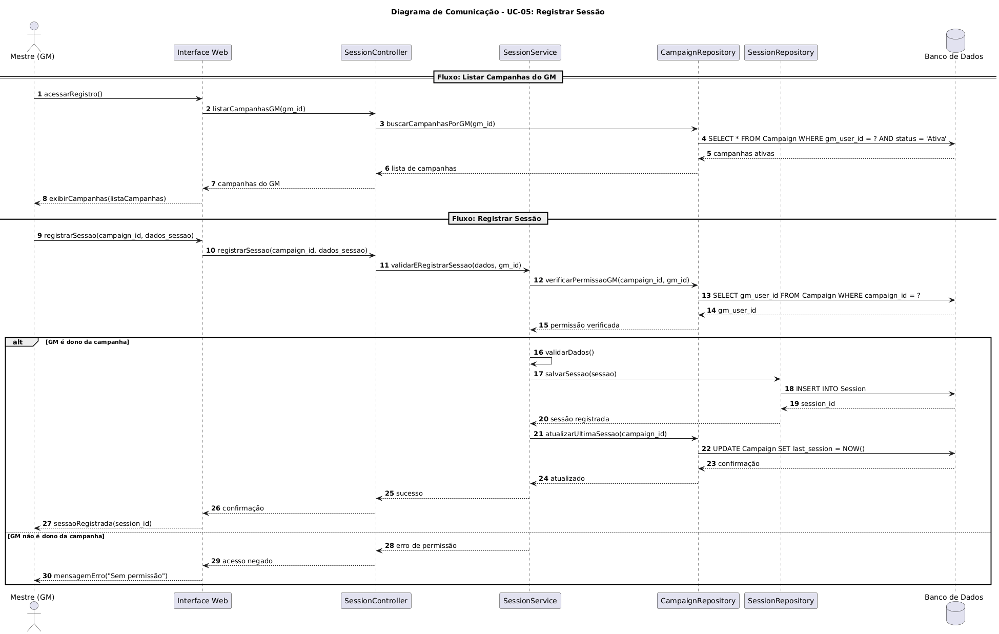

### 3.6 Diagramas de Estados

Os diagramas de estado modelam o ciclo de vida de entidades-chave e do estado de autenticação:

#### Ciclo de Vida da Campanha

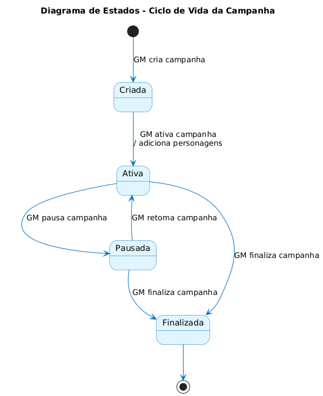

Estados: Criada → Ativa (pode ir para Pausada e voltar) → Finalizada.

#### Ciclo de Vida do Personagem

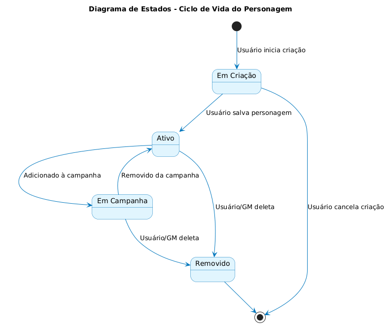

Estados: Em Criação → Ativo (salvo) → Em Campanha (adicionado). Pode ser Removido (deleção ou cancelamento da criação).

#### Ciclo de Vida da Sessão

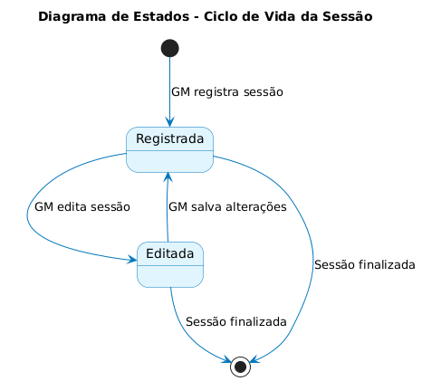

Estados: Registrada → Editada (pode voltar) → Finalizada.

#### Estados de Autenticação

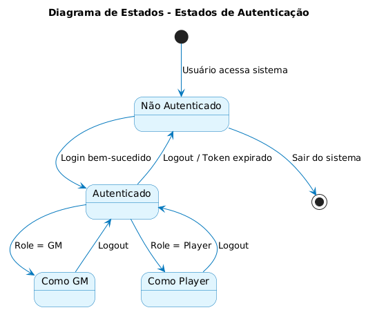

Estados: Não Autenticado → Autenticado → Como GM ou Como Player.

---

## 4. Modelos de Dados

O modelo de dados (Diagrama Entidade-Relacionamento) define as tabelas e seus atributos no banco de dados:

| Tabela | Colunas Chave e Relevantes |
|--------|---------------------------|
| **users** | user_id (PK), role, isGM, isPlayer |
| **rulesets** | ruleset_id (PK), fichatemplate (jsonb) |
| **campaigns** | campaign_id (PK), status, gm_user_id (FK), ruleset_id (FK), last_session |
| **characters** | character_id (PK), is_npc (boolean), ficha_data (jsonb), owner_user_id (FK), campaign_id (FK) |
| **sessions** | session_id (PK), campaign_id (FK), date, resumo, notas |
| **campaign_character** | id (PK), campaign_id (FK), character_id (FK) |

---
